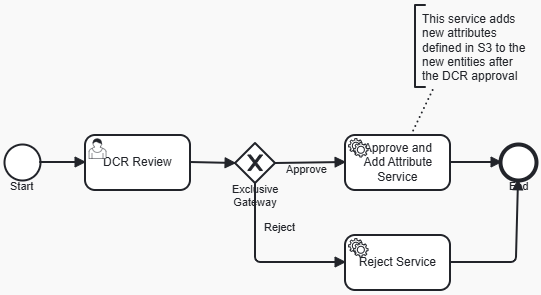

# Adding attributes to new entities based on the instructions located on Amazon S3

## Overview
Data Change Request Review is a process for reviewing Data Change Requests initiated for Reltio profiles.
As a result of review, a DCR can be approved (which results in an Apply DCR operation) or rejected (which results in a Reject DCR operation).

There is a business requirement to add extra attributes for newly created entities suggested in DCRs. 
Configuration of these attributes is stored in a file located on Amazon S3.
This requirement can be accomplished by the following customization.

## Customization
The process is very similar to the standard Data Change Request review,
with the difference of using a custom service task after Approve decision. 
This task, in addition to applying the DCR, checks for new entities created in this change request.

For each newly created entity, it adds some attributes. What attributes to add 
and which entities is controlled with a file with instructions located on Amazon S3.



AWS recommends using the Assume Role feature instead of hardcoded AWS access keys (key/secret) for 
enhanced security and flexibility. Hardcoded credentials pose a security risk as they can be exposed in logs, 
repositories, or shared inadvertently. 
By assuming a role, users gain temporary security credentials, reducing the risk of long-term exposure and 
allowing for more controlled access management. Following this best practice, you can use the 
**_AwsService_**, which provides the following method: 

`Credentials getTemporaryCredentials(AssumeRoleRequest assumeRoleRequest);`

In order to make it possible to assume role and get temporary credentials, some additional configuration is required.

**Data required for setup**
- If you want to use this feature, you need to contact our Support team and share your AWS account ID.
- Our team will then configure the necessary privileges on our end to allow the workflow user to assume roles from your AWS account.

This is an example of how you can get temporary credentials to access AWS resources in your custom workflow:

```java
@WorkflowService
private AwsService awsService;
...
AssumeRoleRequest assumeRoleRequest = new AssumeRoleRequest().withDurationSeconds(3600)
       .withRoleArn("arn:aws:iam::<your_account_id>:role/<reltio-workflow-*>")
       .withRoleSessionName("tenant-name");

Credentials creds = awsService.getTemporaryCredentials(assumeRoleRequest);

AWSStaticCredentialsProvider provider = new AWSStaticCredentialsProvider(
   new BasicSessionCredentials(creds.getAccessKeyId(), creds.getSecretAccessKey(), creds.getSessionToken())
);
AmazonS3 s3Client = AmazonS3ClientBuilder.standard()
   .withCredentials(provider)
   .withRegion(Regions.US_EAST_1)
   .build();
```
