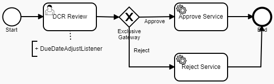

# Data Change Request Review with custom logic for setting due dates

### Overview
Data Change Request Review is a process for reviewing Data Change Requests initiated for Reltio profiles. 
As a result of review, a DCR can be approved (which results in an Apply DCR operation) or rejected (which results in a Reject DCR operation).
The Out-Of-The-Box (OOTB) implementation of DCR Review process sets due date as **P2D** - two days after creation:

```xml
<userTask id="dcrReview" name="DCR Review" activiti:dueDate="P2D" activiti:candidateGroups="ROLE_REVIEWER">
```
This interval includes weekend thus might not be appropriate for some business requirements. If there is a requirement
to exclude non-working days from the due date interval then the below customization will be useful.

### Customization

The provided [process definition](DCR_WeekendAdjusted.bpmn20.xml) differs from the OOTB implementation by a custom listener in "DCR Review" task:

<b>DueDateAdjustListener</b> - adjusts the due date of the task depending on the weekend falling on the period. 

  

> The implementation requires additional changes if there is a need to exclude holidays as well (that depend on locale)