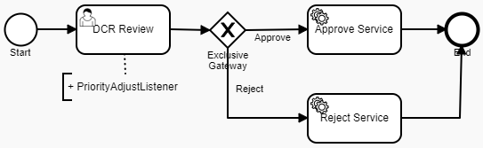

# Data Change Request Review

### Overview
Data Change Request Review is a process for reviewing Data Change Requests initiated for Reltio profiles.
As a result of review, a DCR can be approved (which results in an Apply DCR operation) or rejected (which results in a Reject DCR operation).
The Out-Of-The-Box (OOTB) implementation of DCR Review process sets Medium priority for a task (priority = 50).

#### Available priorities
- Low (1)
- Medium (50)
- High (100)
- Urgent (1000)

Based on business requirements you might need to set different priority for tasks.

### Customization

The provided [process definition](DCR_PriorityChanger.bpmn20.xml) differs from the OOTB implementation 
by a custom listener in "DCR Review" task.

<b>PriorityChangerListener</b> - sets an Urgent priority for a task if a DCR has `CREATE_ENTITY` changes.

  

