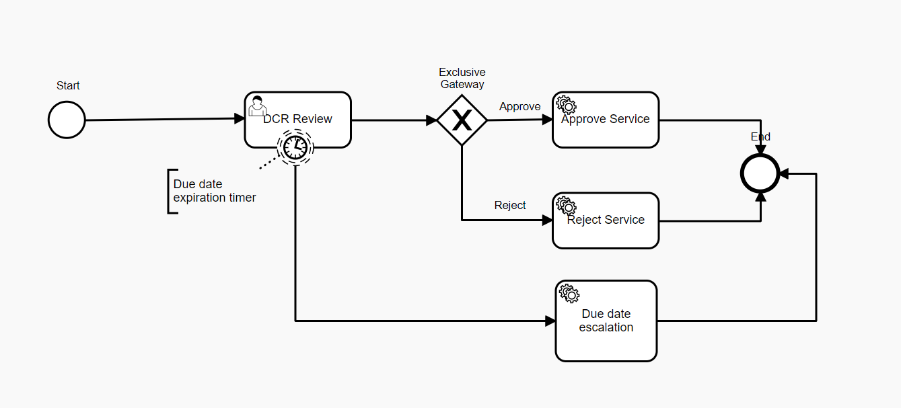

# Data Change Request Review with overdue notifications

### Overview
Data Change Request Review is a process for reviewing Data Change Requests initiated for Reltio profiles. 
As a result of review, a DCR can be approved (which results in an Apply DCR operation) or rejected (which results in a Reject DCR operation).
Default process does not provide any notifications when a task is overdue.

### Customization
#### Single notification

The provided [process definition with overdue notification](dataChangeRequestReview_singleEscalation.bpmn20.xml) demonstrates sending of a single overdue notification after the specified period of time.


To specify the timer's duration before it fires, you need to define a `timeDuration` as a sub-element of `timerEventDefinition`.
```xml
<boundaryEvent id="OverdueTimer" attachedToRef="dcrReview" cancelActivity="false">
  <timerEventDefinition>
    <timeDuration xsi:type="tExpression">P2D</timeDuration>
  </timerEventDefinition>
</boundaryEvent>
```
If the user makes a decision before the end of this period, the timer will not trigger the notification task.
> NOTE: Timer interval uses [ISO 8601](https://en.wikipedia.org/wiki/ISO_8601#Durations) format string to set .

#### Periodic notification
To make notifications periodic, you need to use a `timeCycle` element instead of `timeDuration`. 
```xml
<boundaryEvent id="OverdueTimer" attachedToRef="dcrReview" cancelActivity="false">
    <timerEventDefinition>
        <timeCycle xsi:type="tExpression">R/P1D</timeCycle>
    </timerEventDefinition>
</boundaryEvent>
```
> NOTE: Repeating intervals are adjusted in accordance with [ISO 8601](https://en.wikipedia.org/wiki/ISO_8601#Repeating_intervals).
