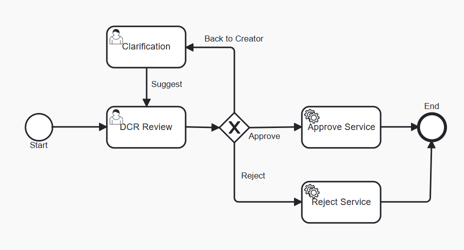

# Data Change Request Review with clarification loop

### Overview
Data Change Request Review is a process for reviewing Data Change Requests initiated for Reltio profiles.
As a result of review, a DCR can be approved (which results in an Apply DCR operation) or rejected (which results in a Reject DCR operation).
The Out-Of-The-Box (OOTB) implementation of DCR Review does not support sending a request back to the initiator for clarification and then continuing the same review by the same data steward.

### Customization

The provided [process definition](dcrWithClarification.bpmn20.xml) extends the OOTB flow with a clarification loop:

- The DCR Review user task adds a third decision option: `BackToCreator`. A comment is required for this decision.
- When `BackToCreator` is chosen, the flow goes to a `Clarification` user task assigned to the original DCR initiator (`${reltioUser}`).
- After the creator makes changes (decision `Suggest`), the process returns to the DCR Review task and is reassigned to the same reviewer who asked for clarification.

To preserve the reviewer identity across the loop, the DCR Review task is configured with a dynamic assignee and a custom listener:

- The task uses `activiti:assignee="${dcrReviewer}"` so that the process variable `dcrReviewer` controls the assignee.
- A custom task listener `com.reltio.workflow.dcr.UpdateDcrReviewerListener` (on `complete` event) stores the current task assignee into the `dcrReviewer` variable. This ensures that when the review restarts after clarification, it is assigned back to the same reviewer.

Key elements in the definition:

- DCR Review user task:
  ```xml
  <userTask id="dcrReview" name="DCR Review" activiti:assignee="${dcrReviewer}" activiti:candidateGroups="ROLE_REVIEWER" activiti:dueDate="P2D">
    <extensionElements>
      <activiti:formProperty id="decision" name="Decision" type="enum" required="true" default="Approve">
        <activiti:value id="Approve" name="Approve" />
        <activiti:value id="Reject" name="Reject" />
        <activiti:value id="BackToCreator" name="BackToCreator" commentRequired="true"/>
      </activiti:formProperty>
      <activiti:taskListener class="com.reltio.workflow.dcr.UpdateDcrReviewerListener" event="complete" />
    </extensionElements>
  </userTask>
  ```

- Clarification user task assigned to the DCR initiator:
  ```xml
  <userTask id="clarification" name="Clarification" activiti:assignee="${reltioUser}" activiti:candidateGroups="ROLE_INITIATE_CHANGE_REQUEST" activiti:dueDate="P2D">
    <extensionElements>
      <activiti:formProperty id="decision" name="Decision" type="enum" required="true" default="Suggest">
        <activiti:value id="Suggest" name="Suggest" />
      </activiti:formProperty>
    </extensionElements>
  </userTask>
  ```

- Process variables used:
  - `dcrReviewer` – stores the reviewer username to reassign the DCR Review task after clarification.
  - `reltioUser` – the DCR initiator; used to assign the Clarification task.

The resulting flow is illustrated below:

  

