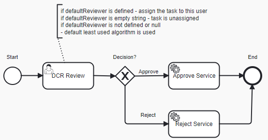

# Data Change Request Review with custom logic for default assignee

### Overview
Data Change Request Review is a process for reviewing Data Change Requests initiated for Reltio profiles. 
As a result of review, a DCR can be approved (which results in an Apply DCR operation) or rejected (which results in a Reject DCR operation).
The Out-Of-The-Box (OOTB) implementation of DCR Review does not have default assignee and its task is assigned to a least-used user from the
group specified in the candidateGroups attribute - ROLE_REVIEWER.

```xml
<userTask id="dcrReview" name="DCR Review" activiti:dueDate="P2D" activiti:candidateGroups="ROLE_REVIEWER">
```

Sometimes this design does not fit business requirements and there is a need to assign the task to a specific user which is 
known at the beginning before starting a workflow process. This requirement can be accomplished by the below customization.

### Customization

1. Update the process definition and set default assignee dynamically using the expression in the assignee attribute.

```xml
<userTask id="dcrReview" name="DCR Review" activiti:assignee="${execution.hasVariable('defaultReviewer') ? defaultReviewer : null}" activiti:dueDate="P2D" activiti:candidateGroups="ROLE_REVIEWER" >
```

2. [Start workflow process](https://developer.reltio.com/private/swagger.htm?module=Tenant%20Management#/Workflow/startProcessInstanceByTenant) 
with the defaultReviewer variable set to the desired assignee.

```json
{
    "processType": "dataChangeRequestReview",
    "objectURIs": [
        "changeRequests/01Ru5Pi"
    ],
    "variables": {
        "defaultReviewer": "username"
    }
}
```

The updated [process definition](dcrDefaultReviewer.bpmn20.xml) has the following flow:

  

> Notice that implementation does not require any Java code - everything is done using capabilities of BPMN and Workflow API 
that allows you to define variables at startup.