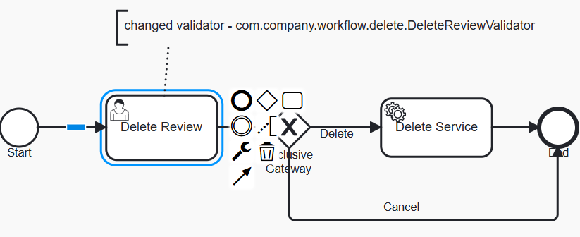

# Recommend for Delete with custom logic for invalidating overdue tasks

### Overview
Recommend for Delete is a process for reviewing requests initiated for Reltio profiles suggested for removing. 
As a result of review, the related entity is either removed or process completed with no further actions.
The Out-Of-The-Box (OOTB) implementation of Recommend for Delete has a default validator set for a user task -
`com.reltio.workflow.core.task.validator.SingleEntityTaskValidator`. This validator verifies that the process was started
for a single entity and the entity still exists.

Invalid tasks are not displayed in UI (neither HUB UI nor Inbox) and removed by [TTL](https://docs.reltio.com/en/engage/manage-data-workflows/workflow-tasks/working-with-tasks/time-to-live-ttl-for-workflow-tasks) 
in 1 year since the creation date. Suppose that there is a business requirement to mark all overdue tasks as invalid and eventually 
remove them by TTL. This requirement can be accomplished by the following customization

### Customization

Deploy the BPMN process diagram - [DeleteReviewWithValidation.bpmn20.xml](DeleteReviewWithValidation.bpmn20.xml) to your tenant.

The updated process definition has the following flow:

  

It has a custom validator [`com.company.workflow.delete.DeleteReviewValidator`](src/main/java/com/company/workflow/delete/DeleteReviewValidator.java) that implements the required logic.