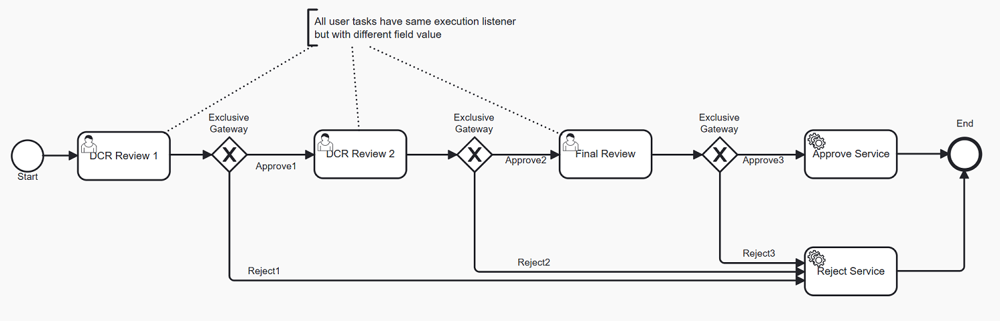
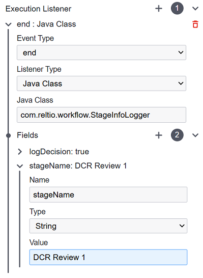

# Data Change Request Review with Three Steps

### Overview

Data Change Request Review is a process for reviewing Data Change Requests initiated for Reltio profiles.
As a result of review, a DCR can be approved (which results in an Apply DCR operation) or rejected (which results in a Reject DCR operation).
The Out-Of-The-Box (OOTB) implementation of DCR Review process has only one user task that is reviewed by a single reviewer.

However, some customers need to implement custom DCR review workflows that include multiple user tasks, various
conditions, and branching approval logic. In such cases, it becomes necessary to track the current stage of the business
process. One approach to achieving this is by storing the name of the current stage in the ExternalInfo field of the
change request.

### BPMN customization

The custom process below consists of multiple sequential user tasks. To apply a change request, approval must be obtained at each
stage.



Each user task shares the same execution listener:  [`com.company.workflow.StageInfoLogger`](src/main/java/com/company/workflow/StageInfoLogger.java). This listener records
the timestamp and decision in the externalInfo of changeRequest. The name of the completed stage is passed to the listener as a
string value, injected through the stageName field:



To inject the stage name, the following field is used in the execution listener:

```java
private com.reltio.workflow.api.expressions.Field stageName;
```
The field value is resolved in the current execution context using one of the following methods:

```java
Object getValue(Execution execution);
Object getValue(Task task);
```

As a result a separate entry is created in externalInfo on completion of each stage. Example of changeRequest with externalInfo:

```json
{
  "uri": "changeRequests/72lgvKS",
  "createdBy": "user@reltio.com",
  "createdTime": 1738754562548,
  "updatedBy": "user2@reltio.com",
  "updatedTime": 1738754615816,
  "changes": {
    "entities/4EvfKLA": [
      {
        "id": "72lgzai",
        "type": "CREATE_ENTITY",
        "createdTime": 1738754562548,
        "createdBy": "user1@reltio.com",
        "newValue": {
          "uri": "entities/4EvfKLA",
          "type": "configuration/entityTypes/HCP",
          "attributes": {},
          "isFavorite": false,
          "crosswalks": [
            {
              "type": "configuration/sources/Reltio",
              "value": "4EvfKLA",
              "dataProvider": true
            }
          ],
          "analyticsAttributes": {}
        }
      }
    ]
  },
  "externalInfo": {
    "processLog": {
      "DCR Review 2": {
        "timeStamp": "2025-02-05 11:23:37.324",
        "decision": "Reject"
      },
      "DCR Review 1": {
        "timeStamp": "2025-02-05 11:23:08.273",
        "decision": "Approve"
      }
    }
  },
  "type": "configuration/changeRequestTypes/default",
  "state": "REJECTED"
}
```