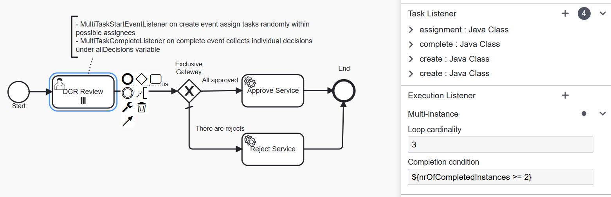

# Data Change Request Review with quorum decision

### Overview
Data Change Request Review is a process for reviewing Data Change Requests initiated for Reltio profiles.
As a result of review, a DCR can be approved (which results in an Apply DCR operation) or rejected (which results in a Reject DCR operation).
The Out-Of-The-Box (OOTB) implementation of DCR Review process has only one user task that is reviewed by a single reviewer.

There is a business requirement to approve a DCR only if changes were approved by at least two reviewers,
otherwise the DCR must be rejected. This requirement can be accomplished by the following customization.

### Customization

The DCR Review user task is changed to be multi-instance with the loop cardinality option set to 3 - as we want the review
to be made by three different reviewers. Completion condition is set to proceed an execution once two reviewers finished their tasks.

The user task has two custom listeners:

- `com.company.workflow.parallel.dcr.MultiTaskStartEventListener` on create event distributes multi instances of 
the task among possible assignees;
- `com.company.workflow.parallel.dcr.MultiTaskCompleteListener` on complete event collects and stores individual decisions
under a final `allDecisions` variable that is handled further in the gateway to flow the execution to either Approve or Reject service.

The modified process definition is [provided](multiTasks.bpmn20.xml).

  

