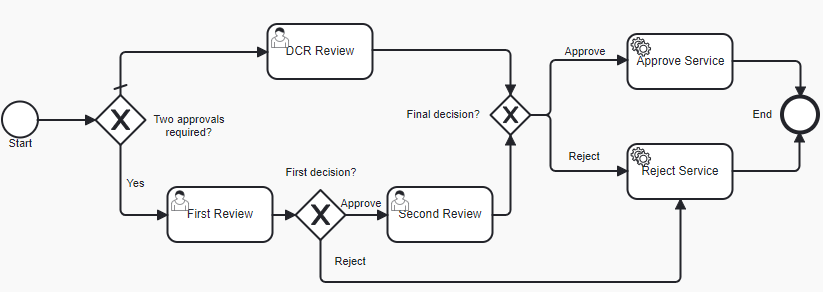

# Data Change Request Review with switcher between OOTB one-step approval and two-steps approval processes

### Overview
Data Change Request Review is a process for reviewing Data Change Requests initiated for Reltio profiles. 
As a result of review, a DCR can be approved (which results in an Apply DCR operation) or rejected (which results in a Reject DCR operation).
The Out-Of-The-Box (OOTB) implementation of DCR Review is a single step review process where a dcrReview user task is reviewed once by a reviewer.

```xml
<userTask id="dcrReview" name="DCR Review" activiti:dueDate="P2D" activiti:candidateGroups="ROLE_REVIEWER">
```

Sometimes this design does not fit business requirements and there is a need to have two-steps approval process for some use cases. 
The decision either execute one-step or two-steps approval flow can be made by a human only at the startup of the workflow process 
and this logic cannot be automated using Java code and service task. This requirement can be accomplished by the below customization.

### Customization

1. Update the process definition where there is a gateway switcher at the beginning of the process that decides which flow to execute
based on a variable 'twoApprovals' set at the startup of the process.

2. [Start workflow process](https://developer.reltio.com/private/swagger.htm?module=Tenant%20Management#/Workflow/startProcessInstanceByTenant) with the 'twoApprovals' variable set to **true** of **false**.

```json
{
    "processType": "dataChangeRequestReview",
    "objectURIs": [
        "changeRequests/01Ru5Pi"
    ],
    "variables": {
        "twoApprovals": true
    }
}
```

Both Review tasks are assigned to the same group of users who have ROLE_REVIEWER role. You can customize it by changing 
candidateGroups property of these tasks and change it to your custom roles that are given to related data stewards.

The updated [process definition](dcrTwoApprovals.bpmn20.xml) has the following flow:

  

Notice that implementation does not require any Java code - everything is done using capabilities of BPMN and Workflow API 
that allows you to define variables at startup.