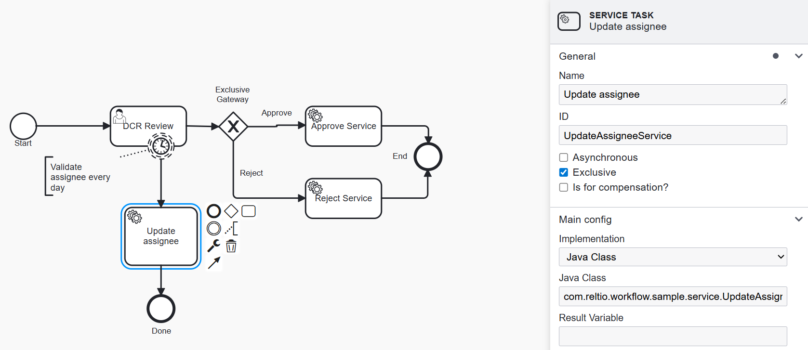

# Reassign Tasks by Schedule

## Overview

This workflow enhancement enables automatic reassignment of user tasks to another reviewer if the current assignee is unavailable or does not respond within a configurable timeframe.

## How It Works

- The process uses an Out-Of-The-Box (OOTB) DCR workflow as a base.
- A boundary timer event triggers a service task every day (or as configured, e.g. `R/P1D`).
- The service task, implemented in `com.reltio.workflow.sample.service.UpdateAssignee`, determines whether a task should be reassigned and selects a new assignee (randomly, by default, from other candidates).
- You can adjust the reassignment logic to match your business needs.

## Process Variables for Secure Authentication

**Required Process Variables**

- `encodedClientId` &mdash; Encrypted OAuth client ID for authentication.
- `encodedClientSecret` &mdash; Encrypted OAuth client secret for authentication.

These variables must be set in process definition. The credentials should **always be encrypted**, never stored in plain text. At runtime, they are decrypted via the utility methods provided.

> **Security Note**  
> The secret key to decrypt these values is defined in the project source. Ensure you comply with your organization’s security practices.

## Process Diagram

See the modified process definition file: [dataChangeRequestReviewUpdateAssignee.bpmn20.xml](dataChangeRequestReviewUpdateAssignee.bpmn20.xml)

## Customization

- *Reassign Logic:* You can adjust the logic in the `UpdateAssignee` class to select reviewers based on your own criteria.
- *Event Frequency:* Change the boundary timer event interval (`R/P1D`) as needed.

---

For more details, review the Java class documentation and the BPMN XML process definition.
