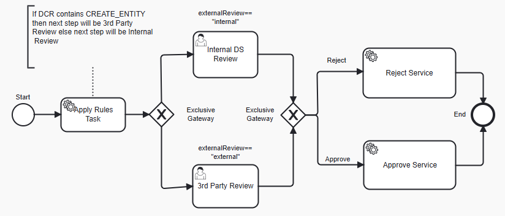

# Data Change Request Review with switcher between internal and external approval

### Overview
Data Change Request Review is a process for reviewing Data Change Requests (DCRs) initiated for Reltio profiles. 
As a result of review, a DCR can be approved (which results in an Apply DCR operation) or rejected (which results in a Reject DCR operation).
The Out-Of-The-Box (OOTB) implementation of DCR Review is a single step review process where all **DCR Review** tasks are
assigned to a reviewer with a `ROLE_REVIEWER` role.

```xml
<userTask id="dcrReview" name="DCR Review" activiti:dueDate="P2D" activiti:candidateGroups="ROLE_REVIEWER">
```

Sometimes this design does not fit business requirements where DCRs with CREATE_ENTITY changes need to be reviewed by a different
group of users. All other DCRs can be reviewed by the default group of reviewers. 
This requirement can be accomplished by the below customization.

### Customization

1. Update the process definition where the first task is a service task with a listener that analyzes the DCR and sets a variable
   `externalReview` that indicates if the execution needs to go to either external or internal flow. 
   The variable is used in the exclusive gateway to route the process to the correct group of reviewers.

2. The process definition has two user tasks: **Internal DS Review** and **3rd Party Review**. The first task is reviewed by default reviewers
   with `ROLE_REVIEWER` role. The second task is reviewed by users with `ROLE_EXTERNAL_REVIEWER` role.

The updated [process definition](ExternalDataChangeRequestReview.bpmn20.xml) has the following flow:

  
